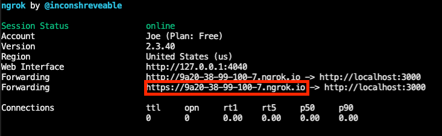

# Button Project

Project by Vinz Angelo Madrigal with guidance by Dr. Neftali Watkinson of UCR.

## Use Case
A web app that allows students to indicate to the professor that they’re currently confused in a lecture.

# Zoom Advanced Sample Documentation

Advanced Sample covers most complex scenarios that might be needed in apps.

App has reference implementation for:
- Authentication flows: marketplace authentication, in-client authentication, third-party auth providers
- REST API calls and retrieving user information
- Zoom Apps SDK methods and events, including role-based permissions
- Guest mode

Tech stack: react js, node.js, express, docker (optional)

## Usage

Requirements:

- Docker
- Ngrok or another reverse proxy

### Setup .env files

Please see the `.env.example` file in the repository.

- Create a `.env` file by copying the example and filling in the values
  - If you are in development, use the Client ID and Client secret under `Development`
  - Lines starting with a '$' are terminal commands; you'll need the openssl program.  Run the command in your terminal and capture the output, or you can use what those values are currently set at for now.
  - Note that the three 'AUTH0' - prefixed fields are optional - see instructions for the Third Party OAuth below.  Leaving out any of these three values will disable this demonstration feature.

### Start your Ngrok (reverse proxy)

Zoom Apps do not support localhost, and must be served over https.  To develop locally, you need to tunnel traffic to this application via https, because the application runs in Docker containers serving traffic from `http://localhost`. You can use Ngrok to do this. Once installed you may run this command from your terminal:

```bash
ngrok http 3000
```

Ngrok will output the origin it has created for your tunnel, eg `https://9a20-38-99-100-7.ngrok.io`. You'll need to use this across your Zoom App configuration in the Zoom Marketplace (web) build flow (see below).

Please copy the https origin from the Ngrok terminal output and paste it in the `PUBLIC_URL` value in the `.env` file.


Please note that this ngrok URL will change once you restart ngrok (unless you purchased your own ngrok pro account).  If you shut down your Ngrok (there's no harm to leaving it on), upon restart you'll need to copy and paste the new origin into the `.env` file AND also to your Marketplace build flow.

## Start developing

### Start containers

- Use the `docker-compose` tool from the root directory to start both the backend and frontend containers:

```
docker-compose up
```
  - Now, you should be getting logs from both the express server/backend and the webpack-dev-server that serves the frontend.

### Install the app

Before proceeding, make sure to:
  - Log in to zoom.us on the web (if not already signed in there)
  - Make sure the user matches the user you've used to log in to the Zoom client 
  - While developing, make sure the user is in the developer account

To install your app and open it the Zoom client's embedded browser, visit:

```
<your Ngrok origin>/api/zoomapp/install
```
 
Any errors you encounter during the add flow are likely related to user mismatches or different/non-developer accounts.  You may also want to double check that your Client ID and Client secret (in the `.env` file) are up to date.
